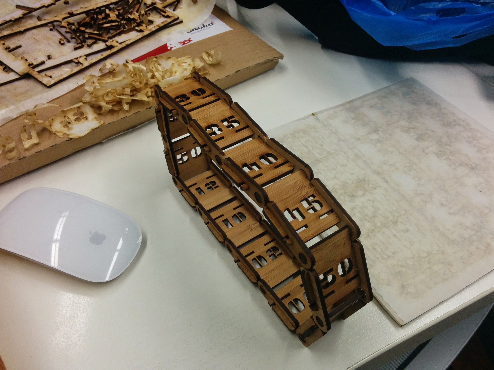

Another variation on my obsession with building clocks of various types - a servo-driven dual-belt design. 

Here's the completed (seconds) belt (there's also a similar 12 segment hours belt):

The remaining work involves some sort of motor and driver system (likely an Arduino and matching motor shield)

Stepper motors: [https://littlebirdelectronics.com.au/products/small-reduction-stepper-motor-5vdc-32-step-1-16-gearing](https://littlebirdelectronics.com.au/products/small-reduction-stepper-motor-5vdc-32-step-1-16-gearing)  
  
Motor control shield: [https://littlebirdelectronics.com.au/products/adafruit-motor-stepper-servo-shield-for-arduino-v2-kit-v2-3](https://littlebirdelectronics.com.au/products/adafruit-motor-stepper-servo-shield-for-arduino-v2-kit-v2-3)