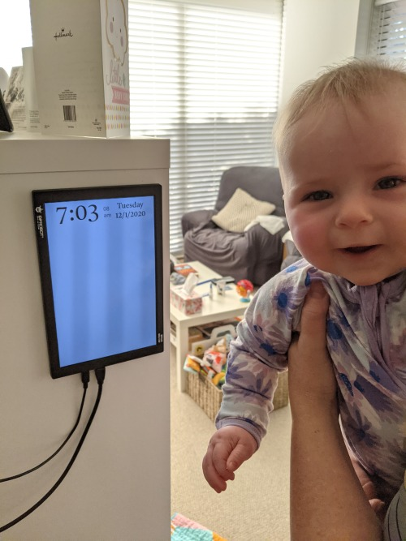

We have a recurring problem in my household - we want to know the same things (current date/time, weather forecast, upcoming calendar events) several times a day, every day, and we each have to fumble individually for a phone to find those things out.

Solution: an ambient screen - an information radiator.

## Ideas
I'd love to use an e-ink display - both for power consumption and aesthetic. A light, low power PC like a Raspberry Pi would suit the scale of the project. Future-proofing would be nice too - using the computer for other services like [Plex](http://plex.tv) would be great.

### Implementation
#### Hardware
 - [DFRobot 10.1" 800x1280 mini-HDMI IPS Display](http://dfrobot.com/product-2063.html). First casualty of the 'light and simple' ethos was the e-ink display - both affording and driving one started to seem way too difficult. Instead we've got a simple little HDMI display - powered by USB (so it's easily hosted the PC) and very reasonably priced.
 - [Gigabyte BRIX-s](https://www.gigabyte.com/au/Mini-PcBarebone/BRIX-s). Here's where I went a little crazy. Instead of 'the simplest thing that works', I started thinking about the 'future-proofing' angle and Plex, and ended up grabbing one of these (from [PC Case Gear](https://www.pccasegear.com/products/48357/gigabyte-brix-gb-blce-4105r-barebone-kit).)
 
#### Software
 - [Ubuntu](https://ubuntu.com/). Had everything I needed - startup items, solid browser, up to date, good support for third party stuff like Plex.
 - [radiator.link](radiator.link). (More about this below.)
 
#### The build

The Gigabyte system was very easy to put together - sensibly designed with good instructions. Dropped in a 	Kingston A400 2.5in SATA SSD 480GB and some Kingston ValueRAM 8GB (1x8GB) 2400MHz CL17 DDR4 SODIMM (also from PC Case Gear), added a USB hard drive [configured using the Ubuntu bootable drive instructions](https://ubuntu.com/tutorials/create-a-usb-stick-on-windows#1-overview) and it booted perfectly the first time. 

#### Configuration

Once I had Ubuntu up and running (after a little fiddling with my wifi config to disable AP isolation so I could connect to it) it was time to get it configured.

1. SSH access. Super simple - just `apt-get install openssh-server`, and [keep an eye out for the firewall](openssh-server).
2. Tweak the display. The notes for the monitor apologetically explain that it starts in portrait mode - but actually this was what I wanted. What I quickly realised though is that the cables plug into what is then the 'top' of the display, so I flipped the display in Ubuntu's display settings.

Next I had to think about the actual presentation - what I wanted to display, and how. I wanted a kind of 'kiosk mode' - no OS chrome, no mouse pointer, no login. Simple things first - `apt-get install unclutter` gave me the mouse hiding behaviour I wanted, just by adding `unclutter -idle 1.0 -root` as a startup item; and Ubuntu includes [automatic login](https://help.ubuntu.com/stable/ubuntu-help/user-autologin.html.en) as a preference.

Then, information display. I wanted something configurable, with at least date and time, weather forecast, calendar events. Being a web developer my first thought was to whip something up using those tools, and with a little experimentation I found that Firefox has a built in kiosk mode that I could exploit by creating another startup item like this: `firefox --kiosk https://radiator.link/for/our-cool-radiator`.

#### [Radiator.link](http://radiator.link)

I felt like I was going to be hacking on this for a while, and that it might be useful for others too, so I [grabbed a cheap domain name](https://www.crazydomains.com.au/) (not so cheap after I had to spending twice the cost of the domain for basic TXT record tools, frustratingly) and some handy [Firebase hosting](https://firebase.google.com/products/hosting).

The site is my [default barebones web stack](https://github.com/simonhildebrandt/my-webbapp-starter) - [Browserify](http://browserify.org/), [Babel](https://babeljs.io/), [React](https://reactjs.org/), plus best-in-class supporting libraries [Luxon](https://moment.github.io/luxon/) and [Axios](https://github.com/axios/axios). (In the future it'll use Firebase for managing personal details, for customisation.)

The finished result (plus photobomber.)

#### Update, January 2021

All configuration moved to Firebase, with unique URLs to access different instances; OpenWeatherMap and Google Calendar integration complete.